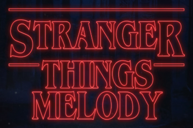

Recreate the iconic Stranger Things theme melody note-by-note with this interactive Vue.js application powered by Web Audio API.

[](https://vuejs.org/)
[](https://www.typescriptlang.org/)
[](https://developer.mozilla.org/en-US/docs/Web/JavaScript)
[](https://developer.mozilla.org/en-US/docs/Web/HTML)
[](https://developer.mozilla.org/en-US/docs/Web/CSS)
[](https://vitejs.dev/)
[](https://nodejs.org/)
[](https://www.npmjs.com/)
[](https://developer.mozilla.org/en-US/docs/Web/API/Web_Audio_API)

## Table of Contents
1. [Learning Goals](#learning-goals)
2. [Prerequisites](#prerequisites)
3. [Project Setup](#project-setup)
4. [Design Decisions](#design-decisions)
5. [Initial Audio Testing](#initial-audio-testing)
6. [Multiple Notes](#multiple-notes)
7. [Keyboard Functionality](#keyboard-functionality)
8. [Rolling Keys](#rolling-keys)
9. [More Design Decisions](#more-design-decisions)
10. [Future Enhancements](#future-enhancements)
11. [Contact](#contact)

## Learning Goals

This project served as my introduction to Vue.js, focusing on:

- Reactive references
- Composition API state management
- Lifecycle hooks
- Web Audio API integration for real-time sound generation

## Prerequisites

Before you begin, ensure you have the following installed:

### **Node.js**
- Download from: https://nodejs.org/
- Verify installation:
```bash
node -v
```

### **NPM**
- Comes with Node.js
- Verify installation:
```bash
npm -v
```

### **Git** (optional, for cloning)
- Download from: https://git-scm.com/
- Verify installation:
```bash
git --version
```

---

## Project Setup

### 1. Clone the Repository

```bash
git clone https://github.com/SeaForeEx/stranger-things-melody.git
cd stranger-things-melody
```

### 2. Install Dependencies
```bash
npm install
```

### 3. Run the Development Server
```bash
npm run dev
```

Open your browser to `http://localhost:5173/`

---

## Design Decisions

---

## Initial Audio Testing

---

## Multiple Notes

---

## Keyboard Functionality

---

## Rolling Keys

---

## More Design Decisions

---

## Future Enhancements

---

## Contact

Questions or feedback? Feel free to reach out:
- **Email:** charlesbridgersiv@gmail.com
- **LinkedIn:** [Charles Bridgers IV](https://www.linkedin.com/in/charlesbridgersiv/)
- **GitHub:** [SeaForeEx](https://github.com/SeaForeEx)

---

Thank you for reviewing my Stranger Things Melody App!
