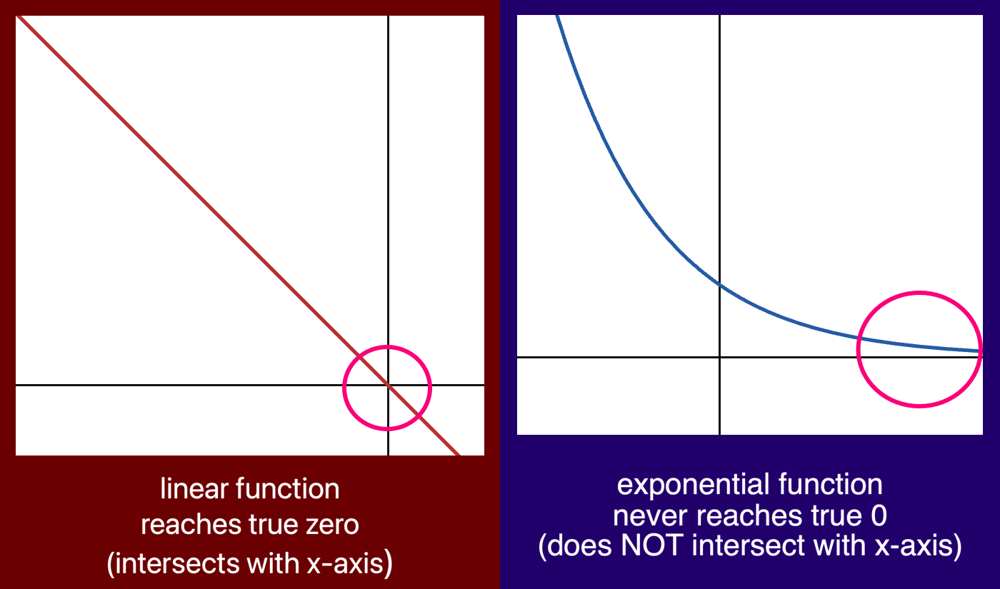
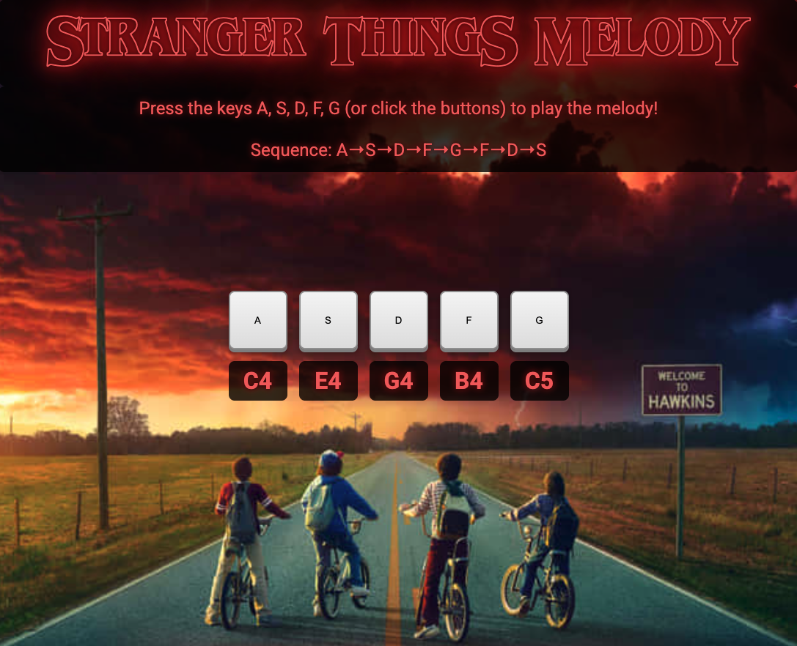
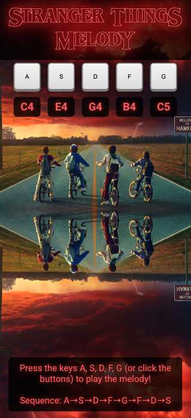
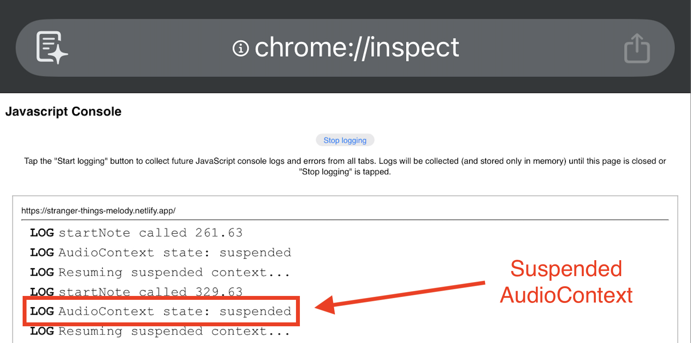

Recreate the iconic Stranger Things theme melody note-by-note with this interactive Vue.js application powered by Web Audio API.

[](https://stranger-things-melody.netlify.app/)

[](https://vuejs.org/)
[](https://www.typescriptlang.org/)
[](https://developer.mozilla.org/en-US/docs/Web/JavaScript)
[](https://developer.mozilla.org/en-US/docs/Web/HTML)
[](https://developer.mozilla.org/en-US/docs/Web/CSS)
[](https://vitejs.dev/)
[](https://nodejs.org/)
[](https://www.npmjs.com/)
[](https://developer.mozilla.org/en-US/docs/Web/API/Web_Audio_API)
[](https://app.netlify.com/projects/stranger-things-melody/deploys)

## Table of Contents
1. [Learning Goals](#learning-goals)
2. [Prerequisites](#prerequisites)
3. [Project Setup](#project-setup)
4. [Design Decisions](#design-decisions)
5. [Play One Note](#play-one-note)
6. [Multiple Notes](#multiple-notes)
7. [Keyboard Functionality](#keyboard-functionality)
8. [Sustain Notes](#sustain-notes)
9. [Rolling Keys](#rolling-keys)
10. [Eliminating Audio Clicks](#eliminating-audio-clicks)
11. [More Design Decisions](#more-design-decisions)
12. [Mobile Compatibility Challenge](#mobile-compatibility-challenge)
13. [Future Enhancements](#future-enhancements)
14. [Contact](#contact)

## Learning Goals

This project served as my introduction to Vue.js, focusing on:

- Reactive references
- Composition API state management
- Lifecycle hooks
- Web Audio API integration for real-time sound generation

## Prerequisites

Before you begin, ensure you have the following installed:

### **Node.js**
- Download from: https://nodejs.org/
- Verify installation:
```bash
node -v
```

### **NPM**
- Comes with Node.js
- Verify installation:
```bash
npm -v
```

### **Git** (optional, for cloning)
- Download from: https://git-scm.com/
- Verify installation:
```bash
git --version
```

---

## Project Setup

### 1. Clone the Repository

```bash
git clone https://github.com/SeaForeEx/stranger-things-melody.git
cd stranger-things-melody
```

### 2. Install Dependencies
```bash
npm install
```

### 3. Run the Development Server
```bash
npm run dev
```

Open your browser to `http://localhost:5173/`

---

## Design Decisions

One thing I've learned about my process is that I prefer making the site visually appealing before diving into functionality. For some reason, working on code becomes easier when I genuinely like what I'm looking at.

### Desktop View


I downloaded a free Stranger Things-style font from [FontGet](https://www.fontget.com/font/stranger-things-1/). It included an outlined version that I used in the "Welcome to Hawkins" header.

Then I generated the Stranger Things Melody background using the Pixel Frame [Stranger Things Font Generator](https://pixelframe.design/stranger-things/).

Finally, I created five buttons representing the five notes in the basic Stranger Things melody, with each note labeled on its button. I considered simulating an actual keyboard layout, but chose individual buttons to create a more intuitive experience for users who have never played piano before.

### Mobile View


When designing the mobile view, I realized the desktop background didn't translate well to taller screens. I considered creating a different background entirely, but then it hit me: I could stack the background vertically with the bottom half flipped upside down—mirroring the Upside Down from Stranger Things. It solved the problem creatively and stayed true to the theme. Everyone wins!

---

## Play One Note

Before I could create a set of notes to play the Stranger Things melody, I decided that I needed to test Web Audio API by playing one note from its built-in oscillator. I chose the C4 note as that would be the first note in the melody.

Here's the code:

```vue
<script setup lang="ts">
import { ref, onMounted } from 'vue'

const audioContext = ref<AudioContext | null>(null)

onMounted(() => {
    audioContext.value = new AudioContext()
})

function playNote() {
    if (!audioContext.value) return

    const oscillator = audioContext.value.createOscillator()
    const gainNode = audioContext.value.createGain()

    oscillator.connect(gainNode)
    gainNode.connect(audioContext.value.destination)

    oscillator.frequency.value = 261.63
    oscillator.type = 'sine'
    gainNode.gain.value = 0.3

    const now = audioContext.value.currentTime
    oscillator.start(now)
    oscillator.stop(now + 0.5)
}
</script>

<template>
    <div class="app-container">
        <div class="outlined header">Welcome to HawkinS</div>
        <button @click="playNote">Play C Note</button>
    </div>
</template>

<style scoped></style>
```

Every `.vue` file is a Single File Component combining HTML, TypeScript, and CSS in one place. While Vue supports scoped styles within each component, I opted for a separate global CSS file linked in `index.html`. I prefer external stylesheets and find that internal CSS clutters the file too much. For a more complex app, I'd likely use scoped CSS per component alongside a global stylesheet for shared styles.

Let's break this code down:

```typescript
import { ref, onMounted } from 'vue'

const audioContext = ref<AudioContext | null>(null)

onMounted(() => {
    audioContext.value = new AudioContext()
})
```

`ref` is a built-in Vue function that declares reactive state when using the Composition API. Similar to React's `useState` hook, the `ref` below creates the `audioContext` state variable, but without separate getter and setter functions. Vue allows direct mutation of the state through `.value`, and tracks those changes automatically for reactivity.

`onMounted` is a lifecycle hook that executes after the Vue component is mounted on the DOM. Here, it initializes the `audioContext` reactive variable from `null` to a new `AudioContext` instance, giving us access to the Web Audio API for creating oscillators and controlling audio playback.

Now let's break down the `playSound()` function:

```typescript
if (!audioContext.value) return
```

This safety check exits the function immediately if `audioContext` is still null (hasn't been initialized yet).

```typescript
const oscillator = audioContext.value.createOscillator()
const gainNode = audioContext.value.createGain()
```

These lines create an oscillator node (sound generator) and a gain node (volume controller).

```typescript
oscillator.connect(gainNode)
gainNode.connect(audioContext.value.destination)
```

These lines create a basic audio routing chain so the user can hear the sound. The oscillator connects to the gain node for volume control, and the gain node connects to the device's speakers or headphones (the `destination`).

```typescript
oscillator.frequency.value = 261.63
oscillator.type = 'sine'
gainNode.gain.value = 0.3
```

These lines configure the sound properties. The oscillator frequency is set to 261.63 Hz (C4 note), the wave type is set to sine (the basic building block of sound: a smooth, pure tone), and the gain is set to 0.3 (30% volume).

```typescript
const now = audioContext.value.currentTime
oscillator.start(now)
oscillator.stop(now + 0.5)
```

These lines control when the note plays and for how long. `audioContext.currentTime` gets the current timestamp from the audio clock—similar to how React uses `Date.now()` for time tracking, but far more precise for audio scheduling. The oscillator starts immediately at that timestamp and stops 0.5 seconds later, creating a half-second note.

Now here's the button created in the HTML template:

```html
<button @click="playNote">Play C Note</button>
```

`@click` is Vue's equivalent to JavaScript's `addEventListener('click')`. It calls `playNote` when the button is clicked.

---

## Multiple Notes

Now that I had successfully connected to the Web Audio API to play the first note, it was time to play all five notes in the Stranger Things melody. This was a straightforward step: I created five buttons that each pass their specific frequency to the `playNote()` function.

Here's the basic code:

```typescript
function playNote(note: number) {
    oscillator.frequency.value = note
}

<button @click="playNote(261.63)">C4</button>
<button @click="playNote(329.63)">E4</button>
<button @click="playNote(392.0)">G4</button>
<button @click="playNote(493.88)">B4</button>
<button @click="playNote(523.25)">C5</button>
```

---

## Keyboard Functionality

While it is fun to click on buttons and hear a sound, it just didn't feel right. I need the tactile sensation of pressing a key, so I decided to add keyboard functionality to add a layer of realism to my app.

Here are the steps I took to add keyboard functionality:

### Create Global State for Oscillator and Gain Nodes

```typescript
const currentOscillator = ref<OscillatorNode | null>(null)
const currentGain = ref<GainNode | null>(null)
```

I wanted only one note to play at a time, when a new note starts, the current one should stop. To handle this, I split `playNote()` into two functions: `startNote()` and `stopNote()`. Since both functions need to modify the same oscillator and gain node, I moved them into global state so they could be accessed and controlled by both functions.

### Added Keyboard Event Listeners to onMounted Composition API function

```typescript
onMounted(() => {
    window.addEventListener('keydown', handleKeyDown)
    window.addEventListener('keyup', handleKeyUp)
})
```

I used Vue event listeners for the button clicks because `@click` connects directly to button elements. For keyboard input, I used JavaScript event listeners attached to the `window` object because keyboard events aren't tied to a specific element but need to work anywhere on the page.

When a key is pressed, `keydown` calls `handleKeyDown`. When released, `keyup` calls `handleKeyUp`. Both functions receive information about which key was pressed through the `KeyboardEvent` object, allowing them to look up the correct frequency.

### Import/Create onUnmounted Composition API function with Keyboard Event Listeners

```typescript
import { onUnmounted } from 'vue'

onUnmounted(() => {
    window.removeEventListener('keydown', handleKeyDown)
    window.removeEventListener('keyup', handleKeyUp)
})
```

`onUnmounted()` is a lifecycle hook that runs cleanup code when the component is destroyed or removed from the DOM. It removes the keyboard event listeners that were added in `onMounted()`. Without this cleanup, the listeners would continue to exist even after the component is gone, creating a memory leak that can slow down or crash the app over time.

This isn't a problem right now for my single-page app, as the component only unmounts when the user leaves the page. I kept it to practice proper cleanup patterns for when I build larger scale Vue apps with multiple components and routing.

### Connect Keyboard to Frequencies

```typescript
const keyToFrequency: Record<string, number> = {
    a: 261.63, // C4
    s: 329.63, // E4
    d: 392.0, // G4
    f: 493.88, // B4
    g: 523.25, // C5
}
```

`keyToFrequency` is a lookup table that maps keyboard keys (`a`, `s`, `d`, `f`, `g`) to their corresponding musical note frequencies. 

```typescript
function handleKeyDown(event: KeyboardEvent) {
    const key = event.key.toLowerCase()
    const frequency = keyToFrequency[key]

    startNote(frequency)
}

function handleKeyUp(event: KeyboardEvent) {
    const key = event.key.toLowerCase()
    const frequency = keyToFrequency[key]

    stopNote()
}
```

When a key is pressed, `handleKeyDown()` uses this object to find the correct frequency to play. When released, `handleKeyUp()` checks if the key is in this mapping before stopping the note.

---

## Sustain Notes

My synthesizer was ending notes after 0.5 seconds, but I wanted them to sustain as long as the user held down the button or key.

### startNote function splits into playNote and stopNote functions

```typescript
function startNote() {
    oscillator.start()
    currentOscillator.value = oscillator
    currentGain.value = gainNode
}
```

`startNote()` begins playing the note without a stop time, letting it sustain indefinitely. It stores the oscillator and gain node in global state so `stopNote()` can access them when the user releases.

```typescript
currentOscillator.value.stop(now + 0.05)
currentOscillator.value = null
currentGain.value = null
```

`stopNote()` stops the oscillator after a 0.05 second fade out, then resets `currentOscillator` and `currentGain` to null so a new note can be played.

---

## Rolling Keys

After creating `startNote()` and `stopNote()`, I realized I couldn't smoothly transition between notes when playing on the keyboard. I had to fully release one key before pressing another, which made playing feel choppy. I needed a fix for a more fluid playing experience.

This required a long rubber ducking session where I had to think through the oscillator audio process and learn some new concepts along the way.
```typescript
if (!audioContext.value || currentOscillator.value) return
```

This line in the `startNote()` function would exit if any note was already playing, preventing multiple notes from sounding simultaneously. That was one roadblock I had to fix.

The main issue was my global `currentOscillator` variable. I only had storage for one oscillator but needed at least five, one for each note in the Stranger Things melody.

At first, I created a `keyToOscillator` object similar to the `keyToFrequency` object that connects keys to their assigned frequencies. My initial plan was to pass the specific oscillator to the `startNote()` function.

```typescript
const activeOscillators = ref<Map<number, [OscillatorNode, GainNode]>>(new Map())
```

After some research, I realized I needed to create a Map in global state to track all active oscillators. Unlike a single variable, a Map allows for dynamic changes and can track multiple oscillators simultaneously. This enabled me to press two keys at once for a smoother, more fluid playing experience.

I decided to store both the Oscillator Node and Gain Node together in the `activeOscillators` Map because both are needed to properly stop a note: the oscillator ends playback and the gain creates a smooth fade out.

The refactoring turned out to be simpler than expected. After replacing the single `currentOscillator` variable with the `activeOscillators` Map (keyed by frequency), I only needed to make small adjustments to the `startNote()` and `stopNote()` functions to use Map methods instead of direct variable assignment.

```typescript
function startNote(note: number) {
    // ...

    if (activeOscillators.value.has(note)) return

    // ...

    activeOscillators.value.set(note, [oscillator, gainNode])
}
```

The safety check now uses `.has()` to verify if a note is already playing before creating a new oscillator. To store the nodes, I use the Map's `.set()` method to add a new key-value pair, with the frequency as the key and an array containing both the oscillator and gain node as the value. This approach stores both nodes in a single line instead of two separate assignments.

```typescript
function stopNote(note: number) {
    if (!activeOscillators.value) return

    const oscillator = activeOscillators!.value.get(note)

    if (!oscillator || !oscillator[0] || !oscillator[1]) return

    // ...

    oscillator[1].gain.exponentialRampToValueAtTime(0.01, now + 0.05)
    oscillator[0].stop(now + 0.05)

    activeOscillators.value.delete(note)
}
```

The `stopNote()` function required more refactoring. With multiple notes playing simultaneously, I needed to pass the frequency as a parameter to identify which note to stop.

The safety checks needed adjustment to work with the Map structure. The second check verifies that both array elements exist (oscillator[0] is the Oscillator Node, oscillator[1] is the Gain Node).

When applying the fade out and stopping playback, I had to be careful with the array indices. `oscillator[1].gain` applies the volume fade to the Gain Node, while `oscillator[0].stop()` ends the Oscillator's playback. Mixing these up wouldn't work!

Finally, I used the Map's `.delete()` method to remove the frequency key from `activeOscillators`, cleaning up the stopped note.

---

## Eliminating Audio Clicks

After deploying the app, I noticed audible clicking/popping sounds when notes started and stopped, especially on mobile browsers.

### Old Code

```typescript
function startNote(note: number) {
    // ...

    gainNode.gain.value = 0.3
    oscillator.start()

    // ...
}

function stopNote(note: number) {
    // ...

    oscillator[1].gain.exponentialRampToValueAtTime(0.01, now + 0.05)
    oscillator[0].stop(now + 0.05)

    // ...
}
```

The `startNote()` function was setting the volume to 30% instantly, causing an audible click when the note began. The `stopNote()` function was fading the volume exponentially to near-zero over 50 milliseconds, but this was too short and didn't reach true silence (exponential ramps can't reach zero mathematically). These abrupt volume changes created clicking sounds, especially noticeable on mobile browsers.

### New Code

```typescript
function startNote(note: number) {
    // ...
    const now = audioContext.value.currentTime
    gainNode.gain.setValueAtTime(0, now)  // Start at 0% volume
    gainNode.gain.linearRampToValueAtTime(0.3, now + 0.005)  // Ramp to 30% over 5ms
    oscillator.start()
    // ...
}
function stopNote(note: number) {
    // ...
    gain.gain.cancelScheduledValues(now)  // Clear pending automations
    gain.gain.setValueAtTime(gain.gain.value, now)  // Lock current volume (30%)
    gain.gain.linearRampToValueAtTime(0, now + 0.15)  // Ramp to 0% over 150ms
    oscillator.stop(now + 0.2)  // Stop after fade completes
    // ...
}
```

The new `startNote()` function uses the audio clock as a timing reference to smoothly fade the volume from 0% to 30% over 5 milliseconds. This eliminates the initial click caused by the instant volume jump.

The new `stopNote()` function clears any pending volume automations (preventing glitches if multiple keys are pressed rapidly), locks in the current volume (30%), then smoothly fades to silence over 150 milliseconds. This creates a clean release without clicks.

Together, these changes create an attack/release envelope that produces smooth, click-free playback.

I switched from `exponentialRampToValueAtTime()` to `linearRampToValueAtTime()` because exponential curves can never reach true zero mathematically. As I learned from teaching exponential functions to my Algebra 2 students, exponential decay approaches zero but never actually reaches it. Even at 0.01 (1% volume), the sound is still audible, causing a click when the oscillator stops. Linear functions, however, can reach exactly zero, ensuring complete silence before the oscillator stops.

This was a great reminder that understanding the underlying math and audio engineering principles is just as important as knowing the API syntax.

Below are graphs of linear versus exponential functions showing why linear volume reaches true zero while exponential functions asymptotically approach but never reach zero.



---

## More Design Decisions

When I showed my kid the website, she immediately cringed. She hated the text being in the background and thought the image was too dark. She just confirmed what was in the back of my head while coding: I needed a redesign.



I found an actual Stranger Things background, one that was brighter and looks really cool in both Desktop and Mobile views. The kids look up at the keys and I thought that was nice design work, focuses the user at the buttons. It was a plus that the image had a "Welcome to Hawkins" sign so I could change the header to "Stranger Things Melody" instead of having it covered by the keys.

The buttons also didn't look good, The dark blue color and Stranger Things font were hard to read and didn't fit with the colors of the new background. I decided to simulate the look of computer keyboard keys and use that instead for a more intuitive User Experience. I still kept the notes below the keys for the users who want to know which notes they are playing.

I tested the site by showing it to one of my kiddo's friends and I watched them read the instructions and within a minute they were playing the melody perfectly. SUCCESS!

And the mobile view...



...it's so satisfying to see this background image "Upside Down", it really looks cooler than the previous background image. 

```css
@media (max-width: 480px) {
    .instructions {
        position: fixed;
        bottom: 1rem;
        left: 50%;
        transform: translateX(-50%);
        width: 90%;
        font-size: 1.25rem;
        padding: 0.75rem 1rem;
        margin-bottom: 0;
        z-index: 100;
    }
}
```

I created a media query for the instructions div to show up on the bottom of the screen for the mobile version to avoid crowding up top and provide something to fill up that empty space.

Now that I think about it, it would be cool to take the upside down version of the background and make it look darker, more like the Upside Down from the series.

Good future idea, but my kiddo said "it looks better now", so that's good enough now for MVP.

---

## Mobile Compatibility Challenge

After I deployed the app with Netlify, a challenge arose. The audio playback worked fine on my desktop, but when I tested it on my mobile browser, I heard nothing.

How do you debug a mobile browser? 

I researched several ways and found that navigating to `chrome://inspect` in my desktop Chrome browser was the easiest and most effective way to check console.logs on a mobile browser. Any method that doesn't involve downloading or buying something works for me.



Through the console logs, I discovered that my Chrome mobile browser starts the Web Audio API's AudioContext in a `suspended` state due to autoplay policies. The AudioContext requires explicit user interaction to resume.

```typescript
function startNote(note: number) {
    // ...

    if (audioContext.value.state === 'suspended') {
        try {
            audioContext.value.resume()
        } catch (error) {
            console.error('Failed to resume context:', error)
            return
        }
    }

    // ...
}
```

The conditional in the `startNote()` function checks if the `AudioContext` is suspended. If it is suspended, the `.resume()` call wakes up the context so users can hear sound on their mobile devices.

```html
<button
    class="key-button"
    @mousedown="startNote(261.63)"
    @mouseup="stopNote(261.63)"
    @mouseleave="stopNote(261.63)"
    @touchstart.prevent="startNote(261.63)"
    @touchend.prevent="stopNote(261.63)"
>
```

I also added touch event handlers to the key buttons for better mobile support. The `.prevent` modifier keeps the mouse events from firing if a touch event is triggered, preventing duplicate sound playback.

---

## Future Enhancements

- Create a Play button that would play a demo of the melody
- Tweak the sine wave and create a cooler sound for the oscillator
- Add reverb/delay effects for atmosphere
- Add some more iconic melodies and turn it into a "Famous TV/Movie Melodies" app
- Add visual feedback when keys are pressed (highlight/glow effect)
- Display which key/note is currently playing
- Add volume control slider
- Add different instrument sounds (piano, synth, theremin for that Stranger Things vibe)
- Implement MIDI keyboard support for users with music hardware
- Add sheet music display that highlights notes as they're played
- Create a practice mode that shows which keys to press in sequence

---

## Contact

Questions or feedback? Feel free to reach out:
- **Email:** charlesbridgersiv@gmail.com
- **LinkedIn:** [Charles Bridgers IV](https://www.linkedin.com/in/charlesbridgersiv/)
- **GitHub:** [SeaForeEx](https://github.com/SeaForeEx)

---

Thank you for reviewing my Stranger Things Melody App!
