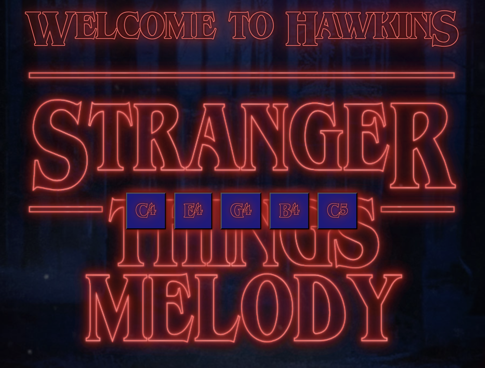
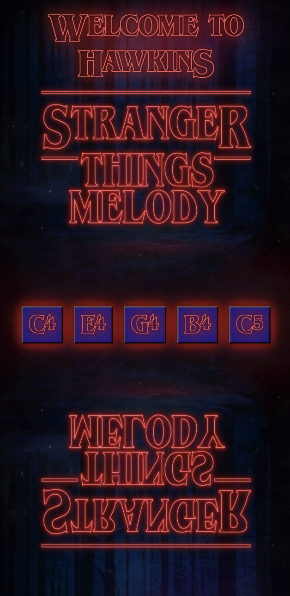

Recreate the iconic Stranger Things theme melody note-by-note with this interactive Vue.js application powered by Web Audio API.

[](https://vuejs.org/)
[](https://www.typescriptlang.org/)
[](https://developer.mozilla.org/en-US/docs/Web/JavaScript)
[](https://developer.mozilla.org/en-US/docs/Web/HTML)
[](https://developer.mozilla.org/en-US/docs/Web/CSS)
[](https://vitejs.dev/)
[](https://nodejs.org/)
[](https://www.npmjs.com/)
[](https://developer.mozilla.org/en-US/docs/Web/API/Web_Audio_API)

## Table of Contents
1. [Learning Goals](#learning-goals)
2. [Prerequisites](#prerequisites)
3. [Project Setup](#project-setup)
4. [Design Decisions](#design-decisions)
5. [Play One Note](#play-one-note)
6. [Multiple Notes](#multiple-notes)
7. [Keyboard Functionality](#keyboard-functionality)
8. [Rolling Keys](#rolling-keys)
9. [More Design Decisions](#more-design-decisions)
10. [Future Enhancements](#future-enhancements)
11. [Contact](#contact)

## Learning Goals

This project served as my introduction to Vue.js, focusing on:

- Reactive references
- Composition API state management
- Lifecycle hooks
- Web Audio API integration for real-time sound generation

## Prerequisites

Before you begin, ensure you have the following installed:

### **Node.js**
- Download from: https://nodejs.org/
- Verify installation:
```bash
node -v
```

### **NPM**
- Comes with Node.js
- Verify installation:
```bash
npm -v
```

### **Git** (optional, for cloning)
- Download from: https://git-scm.com/
- Verify installation:
```bash
git --version
```

---

## Project Setup

### 1. Clone the Repository

```bash
git clone https://github.com/SeaForeEx/stranger-things-melody.git
cd stranger-things-melody
```

### 2. Install Dependencies
```bash
npm install
```

### 3. Run the Development Server
```bash
npm run dev
```

Open your browser to `http://localhost:5173/`

---

## Design Decisions

One thing I've learned about my process is that I prefer making the site visually appealing before diving into functionality. For some reason, working on code becomes easier when I genuinely like what I'm looking at.

### Desktop View



I downloaded a free Stranger Things-style font from [FontGet](https://www.fontget.com/font/stranger-things-1/). It included an outlined version that I used in the "Welcome to Hawkins" header.

Then I generated the Stranger Things Melody background using the Pixel Frame [Stranger Things Font Generator](https://pixelframe.design/stranger-things/).

Finally, I created five buttons representing the five notes in the basic Stranger Things melody, with each note labeled on its button. I considered simulating an actual keyboard layout, but chose individual buttons to create a more intuitive experience for users who have never played piano before.

### Mobile View



When designing the mobile view, I realized the desktop background didn't translate well to taller screens. I considered creating a different background entirely, but then it hit me: I could stack the background vertically with the bottom half flipped upside down—mirroring the Upside Down from Stranger Things. It solved the problem creatively and stayed true to the theme. Everyone wins!

---

## Play One Note

Before I could create a set of notes to play the Stranger Things melody, I decided that I needed to test Web Audio API by playing one note from its built-in oscillator. I chose the C4 note as that would be the first note in the melody.

Here's the code:

```vue
<script setup lang="ts">
import { ref, onMounted } from 'vue'

const audioContext = ref<AudioContext | null>(null)

onMounted(() => {
    audioContext.value = new AudioContext()
})

function playNote() {
    if (!audioContext.value) return

    const oscillator = audioContext.value.createOscillator()
    const gainNode = audioContext.value.createGain()

    oscillator.connect(gainNode)
    gainNode.connect(audioContext.value.destination)

    oscillator.frequency.value = 261.63
    oscillator.type = 'sine'
    gainNode.gain.value = 0.3

    const now = audioContext.value.currentTime
    oscillator.start(now)
    oscillator.stop(now + 0.5)
}
</script>

<template>
    <div class="app-container">
        <div class="outlined header">Welcome to HawkinS</div>
        <button @click="playNote">Play C Note</button>
    </div>
</template>

<style scoped></style>
```

Every `.vue` file is a Single File Component combining HTML, TypeScript, and CSS in one place. While Vue supports scoped styles within each component, I opted for a separate global CSS file linked in `index.html`. I prefer external stylesheets and find that internal CSS clutters the file too much. For a more complex app, I'd likely use scoped CSS per component alongside a global stylesheet for shared styles.

Let's break this code down:

```vue
import { ref, onMounted } from 'vue'

const audioContext = ref<AudioContext | null>(null)

onMounted(() => {
    audioContext.value = new AudioContext()
})
```

`ref` is a built-in Vue function that declares reactive state when using the Composition API. Similar to React's `useState` hook, the `ref` below creates the `audioContext` state variable, but without separate getter and setter functions. Vue allows direct mutation of the state through `.value`, and tracks those changes automatically for reactivity.

`onMounted` is a lifecycle hook that executes after the Vue component is mounted on the DOM. Here, it initializes the `audioContext` reactive variable from `null` to a new `AudioContext` instance, giving us access to the Web Audio API for creating oscillators and controlling audio playback.

Now let's break down the `playSound()` function:

```vue
if (!audioContext.value) return
```

This safety check exits the function immediately if `audioContext` is still null (hasn't been initialized yet).

```vue
const oscillator = audioContext.value.createOscillator()
const gainNode = audioContext.value.createGain()
```

These lines create an oscillator node (sound generator) and a gain node (volume controller).

```vue
oscillator.connect(gainNode)
gainNode.connect(audioContext.value.destination)
```

These lines create a basic audio routing chain so the user can hear the sound. The oscillator connects to the gain node for volume control, and the gain node connects to the device's speakers or headphones (the `destination`).

Now here's the button created in the HTML template:

```vue
<button @click="playNote">Play C Note</button>
```

`@click` is Vue's equivalent to JavaScript's `addEventListener('click')`. It calls `playNote` when the button is clicked.

---

## Multiple Notes


---

## Keyboard Functionality

---

## Rolling Keys

---

## More Design Decisions

---

## Future Enhancements

---

## Contact

Questions or feedback? Feel free to reach out:
- **Email:** charlesbridgersiv@gmail.com
- **LinkedIn:** [Charles Bridgers IV](https://www.linkedin.com/in/charlesbridgersiv/)
- **GitHub:** [SeaForeEx](https://github.com/SeaForeEx)

---

Thank you for reviewing my Stranger Things Melody App!
